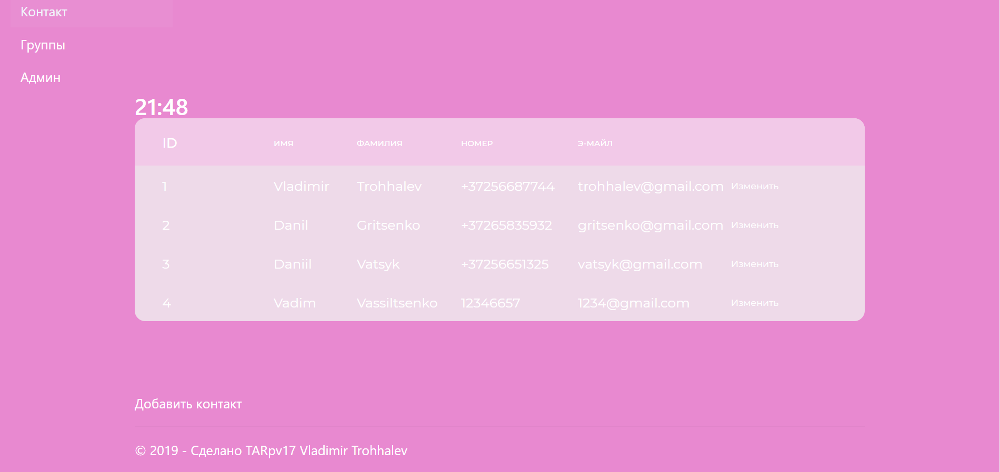

# Книга контактов  
## Документация по первой части задания (PHP + XML)  

### Задание  
Создать веб-страницу книги контактов, с помощью которой, пользователь сможет добавлять контакты, а так же сможет искать нужный контакт по определённому параметру.

### Этапы  
* Создать XML файл, содержащий 2-3 логичесских диапозона.  
* XML файл должен содержать Id, имя, фамилию, номер телефона и адрес электронной почты.  
* Отображение данных в таблице HTML, при помощи PHP.  
* Придумать 3 функции.  
    * Поиск по различным параметрам.  
	* Добавление нового контакта.  
	* Редактирование уже существующего контакта.  
	
### XML файл  
```
<?xml version="1.0" encoding="utf-8"?>
<raamat>
    <kontakt id="1">
		<nimi>Vladimir</nimi>
		<perekonnanimi>Trohhalev</perekonnanimi>
		<telefon>53225533</telefon>
		<email>frixifon@gmail.com</email>
    </kontakt>
	<kontakt id="2">
		<nimi>Vadim</nimi>
		<perekonnanimi>Vassiltseko</perekonnanimi>
		<telefon>53004455</telefon>
		<email>qwilf@gmail.com</email>
    </kontakt>
    <kontakt id="3">
		<nimi>Oleg</nimi>
		<perekonnanimi>Avtomobilev</perekonnanimi>
		<telefon>213124256</telefon>
		<email>bibika12@gmail.com</email>
    </kontakt>
    <kontakt id="4">
		<nimi>Nikita</nimi>
		<perekonnanimi>Vinogradov</perekonnanimi>
		<telefon>59989987</telefon>
		<email>vin@gmail.com</email>
    </kontakt>
	<kontakt id="5">
		<nimi>Danil</nimi>
		<perekonnanimi>Gritsenko</perekonnanimi>
		<telefon>55555588</telefon>
		<email>123@mail.ru</email>
	</kontakt>
	<kontakt id="5">
		<nimi>Kevin</nimi>
		<perekonnanimi>Konstantinov</perekonnanimi>
		<telefon>52145211</telefon>
		<email>konstantinov@gmail.com</email>
	</kontakt>
</raamat>
```

### Чтение XML файла
```
$computers = simplexml_load_file("kniga.xml");
```

### Вывод таблицы всех контактов
```
<table border="1">
    <tr>
        <th>Nimi</th>
        <th>Perenimi</th>
        <th>Telefon</th>
        <th>E-mail</th>
        <th> </th>

    </tr>
    <?php

    foreach($computers -> kontakt as $arvuti) {
        echo "<tr>";
        echo "<td>".($arvuti -> nimi)."</td>";
        echo "<td>".($arvuti -> perekonnanimi)."</td>";
        echo "<td>".($arvuti -> telefon)."</td>";
        echo "<td>".($arvuti -> email)."</td>";
        ?>
        <td><a href="index.php?id=<?php echo $arvuti['id']; ?> ">Muuda</a></td>
        <?php
        echo "</tr>";
    }

    ?>
</table>
```

### Функция поиска по имени
```
function searchByName($query){
    global $computers;
    $result = array();
    foreach ($computers -> kontakt as $computer){
        if (substr(strtolower($computer -> nimi), 0, strlen($query))==strtolower($query))
            array_push($result, $computer);
    }
    return $result;
}
```

### Функция поиска по фамилии
```
function searchBySurname($query){
    global $computers;
    $result = array();
    foreach ($computers -> kontakt as $computer){
        if (substr(strtolower($computer -> perekonnanimi), 0, strlen($query))==strtolower($query))
            array_push($result, $computer);
    }
    return $result;
}
```

### Функция поиска по номеру телефона
```
function searchByNumber($query){
    global $computers;
    $result = array();
    foreach ($computers -> kontakt as $computer){
        if (substr(strtolower($computer -> telefon), 0, strlen($query))==strtolower($query))
            array_push($result, $computer);
    }
    return $result;
}
```

### Функция поиска по адресу электронной почты
```
function searchByEmail($query){
    global $computers;
    $result = array();
    foreach ($computers -> kontakt as $computer){
        if (substr(strtolower($computer -> email), 0, strlen($query))==strtolower($query))
            array_push($result, $computer);
    }
    return $result;
}
```

### Функция редактирования контактов
```
if(isset($_POST['submitSave'])){
    foreach($computers -> kontakt as $arvuti){
        if($arvuti['id'] == $_POST['id']){
            $arvuti -> telefon = $_POST['telefon'];
			$arvuti -> nimi = $_POST['nimi'];
			$arvuti -> perekonnanimi = $_POST['perekonnanimi'];
			$arvuti -> email = $_POST['email'];
            break;
        }
    }
    file_put_contents('kniga.xml', $computers->asXML());
    //header('location:index.php');
}

foreach($computers -> kontakt as $arvuti){
    if($arvuti['id'] == $_GET['id']){
        $id = $arvuti['id'];
        $nimi = $arvuti -> nimi;
        $perenimi = $arvuti -> perekonnanimi;
        $number = $arvuti->telefon;
		$email = $arvuti -> email;
        break;
    }
}
```

### Функция добавления новых контактов
```
if(isset($_POST['submitSave1'])) {
    $human = $computers->addChild('kontakt');
    $human->addAttribute('id', $_POST['id']);
    $human->addChild('nimi', $_POST['nimi']);
    $human->addChild('perekonnanimi', $_POST['perekonnanimi']);
    $human->addChild('telefon', $_POST['telefon']);
    $human->addChild('email', $_POST['email']);
    file_put_contents('kniga.xml', $computers->asXML());
    header('location:index.php');
}
```

### Форма, в которой происходит редактирование и добавление контактов
```
<form method="post">
    <table cellpading="2" cellspacing="2">
            <input type="hidden" name="id" value="<?php echo $id; ?>" readonly="readonly">
        <tr>
            <td>Nimi:</td>
            <td><input type="text" name="nimi" value="<?php echo $nimi; ?>"></td>
        </tr>
        <tr>
            <td>Perenimi:</td>
            <td><input type="text" name="perekonnanimi" value="<?php echo $perenimi; ?>"></td>
        </tr>
        <tr>
            <td>Telefoni number:</td>
            <td><input type="text" name="telefon" value="<?php echo $number; ?>"></td>
        </tr>
		<tr>
            <td>Email:</td>
            <td><input type="text" name="email" value="<?php echo $email; ?>"></td>
        </tr>
        <tr>
			<td><input type="submit" value="Salvesta" name="submitSave1"></td>
            <td><input type="submit" value="Muuda" name="submitSave"></td>
        </tr>
    </table>
</form>
```

## Документация по второй части задания (ASP.NET)
### Задание
Создать веб-сайт с использованием ASP.NET MVC. Создать возможность просмотра списка контактов, добавления контактов, а также добавления контактов в группы (доступно только админу).  
На сайте используется 3 роли:
* (id: 1) Админ
* (id: 2) Пользователь
* (id: 3) Гость

### О ролях
Гость - не зарегестрированный пользователь, не доступен просмотр списка контактов, редактирование, добавление контактов, просмотр групп.
Пользователь - имеет доступ к просмотру списка контактов, может добавлять и редактировать контакты, может просматривать список групп.
Админ - имеет доступ к админ панели, с помощью которой может удалять пользователей и контакты, также может добавлять контакты в группы.

### Сценарий
При заходе на сайт, пользователь видит страницу авторизации, с которой может перейти на страницу регистрации, "О нас" и "Контакт".


После авторизации, у пользователя открывается страница с таблицей контактов, в которуб он также может добавить новый контакт. 

Также после авторизации, у пользователя появляется дополнительная кнопка в меню "Группы", в этой вкладке
